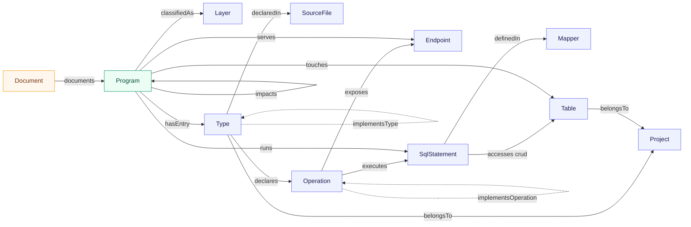

# LLMWiki 온톨로지 스키마 v1.0.0 (확정)

| | |
|---|---|
| 버전 | **1.0.0** — 확정 발행 |
| 원본 | [`llmwiki/ontology.py`](../llmwiki/ontology.py) (이 문서가 아니라 **코드가 원본**) |
| 검증 | `llmwiki ontology validate` · [`tests/test_ontology.py`](../tests/test_ontology.py) 20건 |
| 적용 대상 | Java(Spring MVC) + MyBatis 레거시 시스템 |

---

## 0. 왜 온톨로지인가

이 제품이 푸는 문제는 "산출물이 낡는다" 입니다. 그런데 **스키마도 똑같이 낡습니다.**
문서에 ER 그림을 그려 두면 파서가 먼저 바뀌고 문서는 6개월 뒤에 거짓말이 됩니다.

그래서 스키마를 코드(`llmwiki/ontology.py`)에 두고, 산출물이 스키마를 지키는지
매번 검사합니다. 이 문서는 그 코드를 사람이 읽을 수 있게 설명한 것이며,
**둘이 어긋나면 코드가 맞습니다.**

```bash
llmwiki ontology show               # 스키마 보기
llmwiki ontology validate           # 산출물이 스키마를 지키는지 검사 (CI 용, 위반 시 exit 1)
llmwiki ontology export             # 스키마를 JSON 으로
llmwiki ontology export --graph     # 분석 결과를 온톨로지 그래프로
```

---

## 1. 설계 원칙 세 가지

### 원칙 1 — 타입 집합은 닫혀 있다

노드 11종, 관계 19종. 여기 없는 것은 산출물에 나올 수 없고, 나오면 검증에서 걸립니다.
파서가 새 개념을 만들고 싶으면 먼저 스키마를 고쳐야 합니다. 순서를 강제하는 게 핵심입니다.

### 원칙 2 — 식별자는 결정적이다

같은 소스를 두 번 분석하면 **같은 ID** 가 나옵니다.

```
tbl:default/TB_CUST
type:default/com.gng.inst.cust.CustomerController
op:default/com.gng.inst.cust.CustomerController#list
sql:default/com.gng.inst.cust.CustomerMapper.selectCustomerList
```

ID 가 결정적이어야 **두 시점의 그래프를 빼서 "이번 배포로 무엇이 바뀌었나"** 를
계산할 수 있습니다. 영향도 분석의 다음 단계가 여기 걸려 있습니다.

모든 ID 는 `project_id` 로 시작합니다. 한 화면에서 여러 시스템(기관계/채널계/차세대)을
동시에 열어도 FQN 이 같은 클래스가 섞이지 않습니다.

### 원칙 3 — 모든 사실에 근거(derivation)가 붙는다

이 제품의 신뢰는 여기서 나옵니다. 스키마 레벨에서 셋을 구분합니다.

| derivation | 뜻 | 예 | 틀렸을 때 |
|---|---|---|---|
| `static` | 파서가 소스에서 직접 읽음 | 클래스, SQL, 테이블, 호출 관계 | **파서 버그** — 재현 가능, 테스트로 고정 |
| `derived` | 사실에서 기계적으로 계산 | 프로그램 단위, CRUD 매트릭스, 영향도 | 파서 버그이거나 집계 규칙 문제 |
| `llm` | 모델이 쓴 서술 | 명세서 본문(업무 설명, 처리 로직) | **검토 대상** — 사람이 봐야 함 |

샘플 프로젝트 기준 노드 146개 중 **144개가 `static`** 입니다.
LLM 은 그 사실 위에 설명을 얹을 뿐, 구조를 만들지 않습니다.

> 실무적 함의: 감리·보안 리뷰에서 "이 문서 어디까지 믿을 수 있나"를 물으면
> `derivation: static` 부분은 소스가 근거이고, `llm` 부분만 사람 검토 대상이라고
> 답할 수 있습니다. 문서 전체를 뭉뚱그려 "AI가 만든 것"으로 취급하지 않아도 됩니다.

---

## 2. 전체 그림



파랑 = `static`(파서) · 초록 = `derived`(계산) · 주황 = `llm`(서술)

---

## 3. 노드 (11종)

| 노드 | ID 규칙 | 근거 | 설명 |
|---|---|---|---|
| **Project** | `prj:{project_id}` | static | 분석 대상 시스템 하나. 워크스페이스 등록 단위 |
| **Layer** | `lyr:{project_id}/{name}` | static | 기관계 / 채널계 / 공통. `config.yaml` 의 `project.layers` |
| **SourceFile** | `file:{project_id}/{path}` | static | `source_roots` 기준 상대 경로. 소스 브라우저가 여는 단위 |
| **Type** | `type:{project_id}/{fqn}` | static | 클래스·인터페이스 |
| **Operation** | `op:{project_id}/{fqn}#{method}` | static | 메서드 |
| **Endpoint** | `ep:{project_id}/{url}` | static | 클래스 매핑 + 메서드 매핑을 합친 최종 URL |
| **Mapper** | `mapper:{project_id}/{namespace}` | static | MyBatis Mapper XML |
| **SqlStatement** | `sql:{project_id}/{namespace}.{id}` | static | SQL 문 1개 |
| **Table** | `tbl:{project_id}/{NAME}` | static | 이름은 **항상 대문자 정규화** |
| **Program** | `prog:{project_id}/{slug}` | derived | 명세서 1건 단위 |
| **Document** | `doc:{project_id}/{slug}/{language}` | llm | 생성된 명세서 |

### 값이 닫혀 있는 속성

| 속성 | 허용값 |
|---|---|
| `Type.kind` | `controller` `service` `serviceimpl` `dao` `mapper` `vo` `util` `unknown` |
| `SqlStatement.kind` | `select` `insert` `update` `delete` |
| `accesses.crud` | `C` `R` `U` `D` |
| `derivation` | `static` `derived` `llm` |

### Program 과 Document 를 왜 나눴나

1:1 이라 합칠 수도 있지만 성격이 다릅니다. **Program 은 소스에서 도출한 사실**이고,
**Document 는 특정 시점·특정 모델·특정 언어로 만든 생성물**입니다.
분리해 두면 한 프로그램에 한국어·영어 명세서를 각각 붙이거나, 모델을 바꿔 재생성했을 때
이전 문서를 남겨 두는 것이 스키마 변경 없이 됩니다.

---

## 4. 관계 (19종)

### 구조 — 소스에서 그대로 읽는 것

| 관계 | 도메인 → 레인지 | 카디널리티 | 근거 |
|---|---|---|---|
| `belongsTo` | Type·SourceFile·Mapper·Table·Program·Layer → Project | N:1 | static |
| `declaredIn` | Type → SourceFile | N:1 | static |
| `declares` | Type → Operation | 1:N | static |
| `extendsType` | Type → Type | N:1 | static |
| `implementsType` | Type → Type | N:M | static |

### 실행 흐름 — 이 시스템의 핵심

| 관계 | 도메인 → 레인지 | 카디널리티 | 비고 |
|---|---|---|---|
| `calls` | Operation → Operation | N:M | 수신 변수의 타입을 필드·파라미터·지역변수 선언으로 해석 |
| `implementsOperation` | Operation → Operation | N:M | 인터페이스 → 구현체. 흐름도에서 점선 |
| `executes` | Operation → SqlStatement | N:M | Mapper 메서드명 매칭 또는 `sqlSession` 직접 호출 |
| `exposes` | Operation → Endpoint | 1:N | |
| `definedIn` | SqlStatement → Mapper | N:1 | |
| `accesses` | SqlStatement → Table | N:M | **속성 `crud`** — 같은 쌍에 여러 op 가능 |

`Controller.list → Service.list ⇢ ServiceImpl.list → Mapper.list → SQL →(R) TB_CUST`
이 사슬이 끊기지 않는 것이 명세서 품질의 전부입니다.
`implementsOperation` 이 없으면 인터페이스에서 끊겨 SQL 을 못 찾습니다.

### 집계 — 사실에서 계산하는 것

| 관계 | 도메인 → 레인지 | 카디널리티 | 비고 |
|---|---|---|---|
| `hasEntry` | Program → Type | 1:1 | 진입 컨트롤러 |
| `involves` | Program → Type | N:M | 도달 가능한 클래스 |
| `runs` | Program → SqlStatement | N:M | |
| `touches` | Program → Table | N:M | |
| `serves` | Program → Endpoint | 1:N | |
| `classifiedAs` | Program → Layer | N:1 | |
| `impacts` | Program → Program | N:M | **속성 `via_tables`**. 대칭이지만 양방향 저장 |
| `documents` | Document → Program | 1:1 | derivation `llm` |

`impacts` 를 양방향으로 저장하는 이유: 그래프 질의에서 방향을 신경 쓰지 않아도
되게 하려는 것입니다. 대칭성은 테스트로 강제합니다.

---

## 5. 검증 규칙

`llmwiki ontology validate` 가 실제로 검사하는 것 — 위반 시 CI 에서 `exit 1`.

| 코드 | 수준 | 검사 |
|---|---|---|
| `type.kind` | error | `Type.kind` 가 허용 집합 안인가 |
| `type.id` | error | FQN 이 `package + name` 과 일치하는가 |
| `sql.kind` | error | `SqlStatement.kind` 가 허용 집합 안인가 |
| `sql.id` | error | `full_id == namespace + "." + id` 인가 |
| `sql.definedIn` | error | namespace 에 대응하는 Mapper 가 있는가 |
| `accesses.crud` | error | CRUD 값이 `C/R/U/D` 인가 |
| `accesses.shape` | error | crud 항목이 `[테이블, op]` 2요소인가 |
| `accesses.table` | warning | crud 의 테이블이 `tables` 에도 있는가 |
| `table.case` | error | 테이블명이 대문자로 정규화되었는가 |
| `edge.kind` | error | 엣지 종류가 스키마에 있는가 |
| `edge.domain` / `edge.range` | error | 엣지 양끝 노드가 실제로 존재하는가 |
| `program.id` | error | 프로그램 슬러그가 유일한가 |
| `hasEntry` / `involves` / `runs` | error | 프로그램이 참조하는 대상이 존재하는가 |

테스트는 여기서 한 걸음 더 갑니다 — 그래프의 **모든 엣지가 선언된 도메인/레인지를
지키는지**, **재실행 시 그래프가 바이트 단위로 같은지**까지 확인합니다.

---

## 6. 알려진 한계 (v1.0)

정직하게 적어 둡니다. 이걸 모르고 쓰면 잘못된 결론을 냅니다.

| 한계 | 영향 | 해소 계획 |
|---|---|---|
| **오버로드를 구분하지 않는다** — `op:` ID 에 시그니처가 없음 | 같은 이름 메서드가 한 노드로 합쳐짐 | v1.1 에서 파라미터 타입을 ID 에 포함 |
| **컬럼이 없다** | 컬럼 단위 영향도 불가 | v1.1 `Column` 노드 (예약됨) |
| **리플렉션·동적 프록시 호출을 못 본다** | `calls` 누락 가능 | 정적 분석의 원리적 한계. 런타임 트레이스 병합이 정답 |
| **`Endpoint` 에 HTTP 메서드가 안 붙는다** | `GET /x` 와 `POST /x` 가 한 노드 | v1.1 에서 `http_methods` 채움 |
| **`Program` 단위 = 컨트롤러 1개** | 화면 여러 개를 한 컨트롤러가 담당하면 뭉뚱그려짐 | 화면 설계서 연계 시 재정의 |
| **저장 프로시저 내부를 안 본다** | 프로시저 안의 테이블 접근 누락 | 범위 밖 |

---

## 7. 버전 정책

시맨틱 버저닝을 따릅니다. `index.json` 과 그래프 내보내기에 `ontology` 필드로 박힙니다.

| 변경 | 버전 |
|---|---|
| 노드·관계·속성 **추가**, 선택 속성 추가 | minor (1.0 → 1.1) |
| 노드·관계 **제거**, 의미 변경, ID 규칙 변경, 허용값 축소 | **major** (1.0 → 2.0) |
| 문서 수정, 검증 메시지 개선 | patch |

ID 규칙 변경은 major 입니다. ID 가 바뀌면 과거 그래프와 비교가 불가능해지기 때문입니다.

### v1.1 확장 예약

아직 산출물에 나오지 않지만 **이름을 선점해 둡니다.** 나중에 급하게 만들면
기존 이름과 충돌하거나 의미가 겹칩니다.

| 예약 | 용도 |
|---|---|
| `Requirement` | 요구사항 항목 (입력 폼에서 수집) |
| `ScreenSpec` | 화면 설계 항목 |
| `TestCase` | 요구사항에서 파생한 테스트 케이스 |
| `Column` | 테이블 컬럼 |
| `realizes` | Program → Requirement |
| `verifies` | TestCase → Requirement |
| `hasColumn` | Table → Column |

이 일곱 개가 채워지면 **As-Is 분석 → To-Be 설계 → 개발 → 테스트** 한 사이클이
하나의 그래프 위에서 이어집니다. 요구사항 하나를 클릭하면 그것을 구현한 프로그램,
그 프로그램이 건드리는 테이블, 그것을 검증하는 테스트 케이스가 전부 따라옵니다.
현재 v1.0 은 그 사이클의 **왼쪽 절반**입니다.

---

## 8. 다른 도구에 넘기기

```bash
llmwiki ontology export --graph -o graph.json
```

```json
{
  "ontology": "1.0.0",
  "project": { "id": "default", "name": "샘플 금융시스템" },
  "nodes": [
    { "id": "tbl:default/TB_CUST", "type": "Table",
      "derivation": "static", "project_id": "default", "name": "TB_CUST" }
  ],
  "edges": [
    { "type": "accesses", "source": "sql:default/…selectCustomerList",
      "target": "tbl:default/TB_CUST", "derivation": "static", "crud": "R" }
  ]
}
```

노드/엣지 목록이라 Neo4j·Memgraph 적재, RDF 변환, GraphQL 스키마 생성이
모두 이 JSON 하나에서 출발합니다. LLMWiki 뷰어가 유일한 소비자가 아니어도 되게
설계했습니다 — 고객사가 이미 쓰는 형상관리·감리 도구에 그래프만 넘길 수 있습니다.
